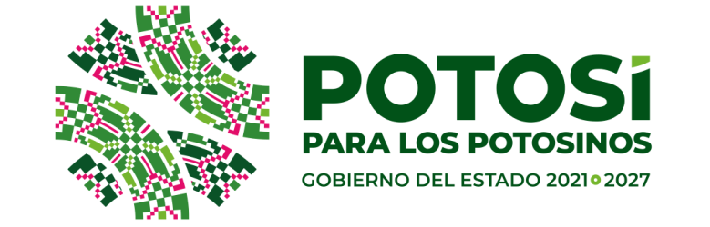

    The fourth ACM Conference on Equity and Access in Algorithms, Mechanisms, and Optimization (EAAMO'24) will be held from <b>29 October - 31 October 2024</b> in San Luis Potosí, Mexico.

- - -

## News:
- Information about the venue, accepted papers, and accepted posters is now available at [conference information](conference_information) page.
- Registration is open! Please visit the [registration page](registration) to register for the conference.
- **Important Notice for ACM EAAMO '24 Participants: Beware of Unaffiliated Emails**

It has come to our attention that some ACM EAAMO '24 participants have received unsolicited emails from a company called **Global Travel Experts** (housing@gtravelhost.com), falsely claiming to have made reservations requiring confirmation. **Please be aware that Global Travel Experts is not affiliated with ACM EAAMO '24 in any capacity.**

**We strongly advise against engaging with these emails or providing any personal information.** ACM EAAMO '24 has not shared participants' email addresses with this or any other third party.

To safeguard your information, we recommend blocking the sender and marking the email as spam.

Thank you for your attention and vigilance!

- - -

<!-- 

    We invite researchers and practitioners to submit their papers by <b>April 17, 2024 (AoE)</b>.

 -->

## About



 The conference aims to highlight work where techniques from algorithms, optimization, and mechanism design, along with insights from the social sciences and humanistic studies, can help improve equity and access to opportunity for historically disadvantaged and underserved communities. The conference will provide an international forum for presenting research papers, problem pitches, survey and position papers, new datasets, and software demonstrations towards the goal of bridging research and practice.

 - - -

 ## Sponsors

<!-- First Line: Five images -->

    
    
    
    
    

- - -

<!-- Second Line: Four images -->

- - -

<!-- Third Line: Two images -->

<!-- 
- - -

- - -

- - -
 -->

<!--  -->