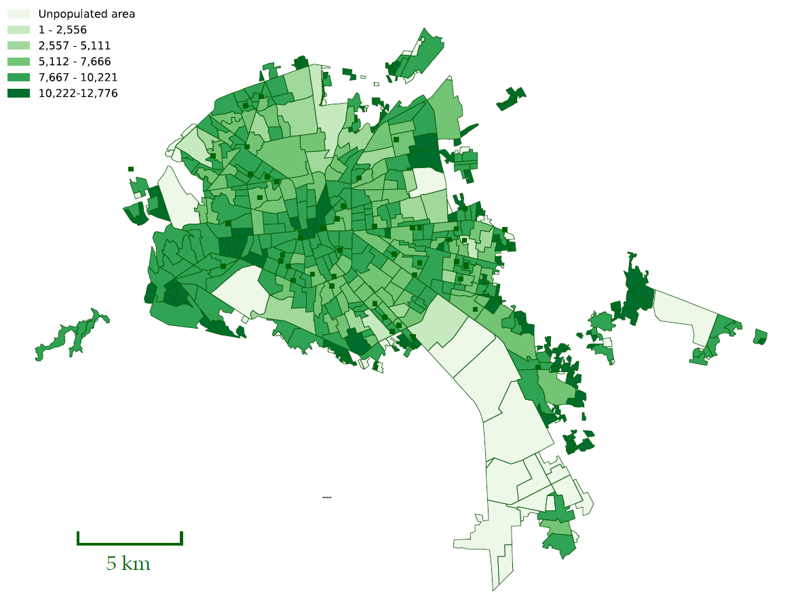
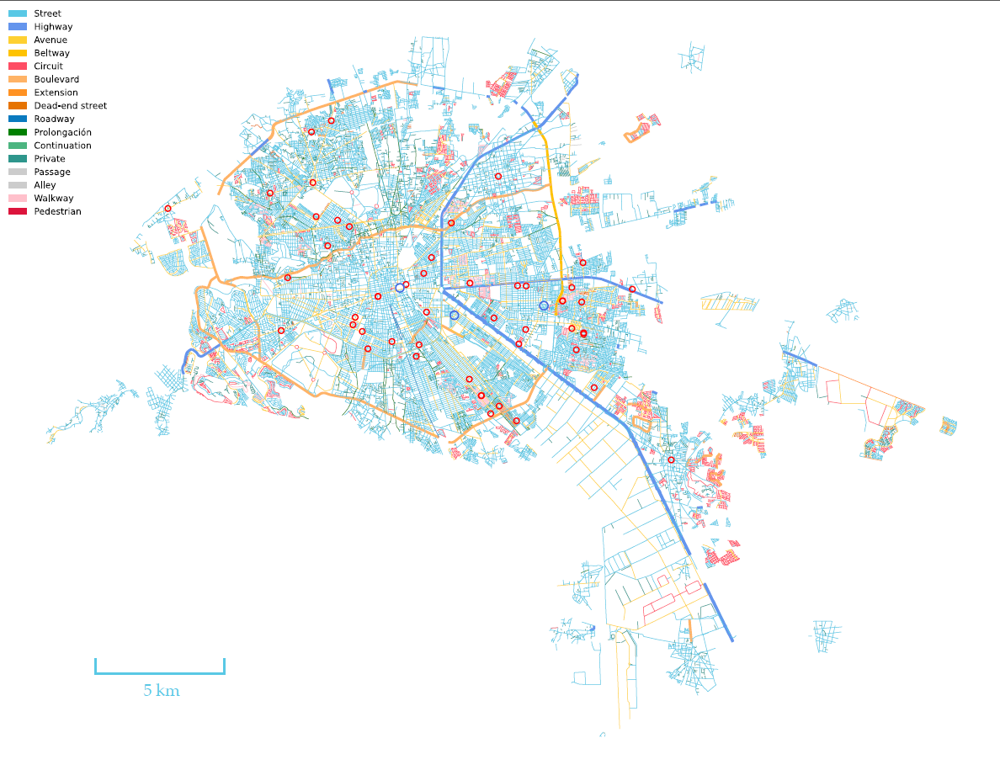
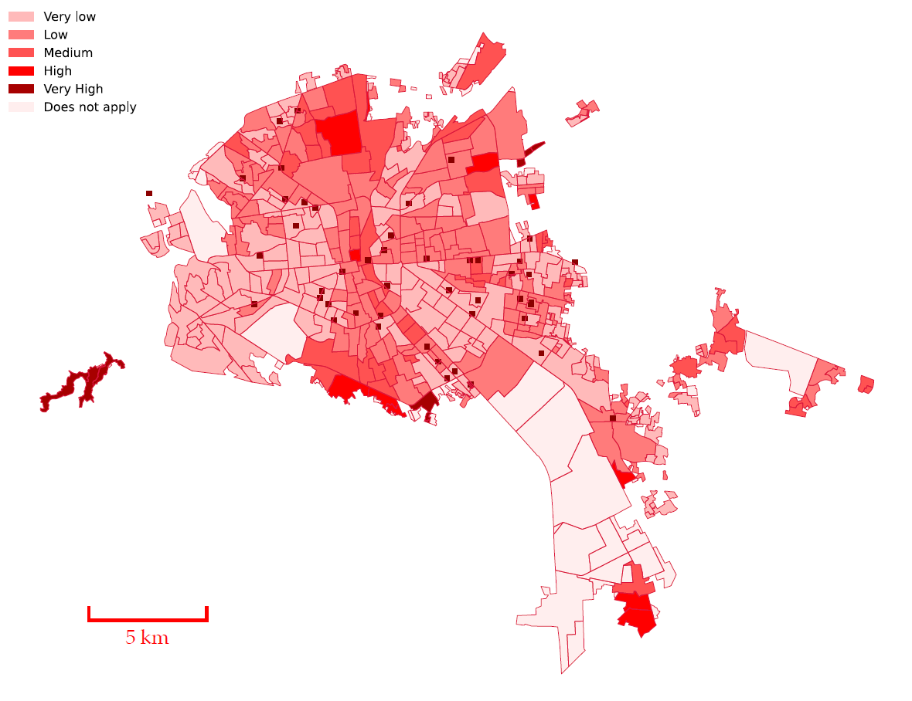
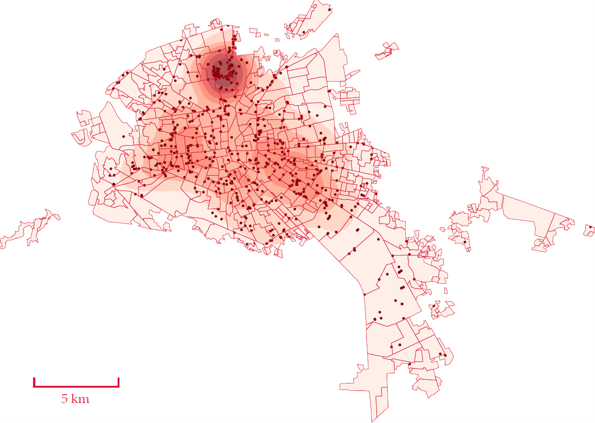

## The Social Hackathon Vision

The Social Hackathon is more than a competition—it’s a call to action for the EAAMO community. This initiative is designed to harness the power of algorithms, optimization, and mechanism design, coupled with insights from the social sciences and humanistic studies, to tackle pressing social issues. Local partners provide curated datasets and extensive context on these issues, aiming to incorporate insights from impacted communities and policymakers. 

**The goal is to create practical tools that bridge the research-to-practice pipeline. Winning teams will continue collaborating with policymakers to refine and implement their solutions.**

## Broad-Level Goals

For this year's Social Hackathon, we are honored to collaborate with Professor Jacqueline Calderon from the Medical School of UASLP and a visiting professor at Boston College. Professor Calderon has curated a comprehensive dataset that includes geotagged rates of environmental contaminants (air pollution, lead, mercury, arsenic, cadmium, and water pollution), along with breast cancer incidence rates in San Luis Potosi and across Mexico. The broad goals of this hackathon are:

1. **Understanding Disparities**: Extend our understanding of the relationship between breast cancer mortality, environmental carcinogens, healthcare, and social disparities among Mexican women.
2. **Creating Dynamic Surveillance Platforms**: Develop a platform for storing, sharing, and analyzing unified databases to identify populations at high risk of breast cancer mortality due to aggregated and cumulative environmental hazards, healthcare infrastructure, and social disadvantages.
3. **Nurturing Digital Ecosystems**: Create a digital ecosystem to visualize temporal and spatial trends at different geographical levels, monitor and predict breast cancer disparities, and provide evidence for decision-makers to strengthen the healthcare system.
4. **Enhancing Technical Capabilities**: Enhance technical capabilities by incorporating cutting-edge technologies to update the healthcare system and provide expert training and support.

## Specific Goals
1. **Priority 1—Improve Public Health Decisions**: Develop novel surveillance systems incorporating algorithms to identify high-risk populations and characterize environmental carcinogen hazards, medical infrastructure, and social environments.
2. **Priority 2—Reduce Barriers to Healthcare**: Improve healthcare access by creating bridges between individuals most in need and healthcare facilities.
3. **Priority 3—Risk Tools**: Enhance breast cancer risk estimation by incorporating environmental carcinogen risks, healthcare access, and social hazards into risk tools, such as the Breast Cancer Risk Assessment Tool by the NCI.
4. **Priority 4—Science Education**: Develop digital tools to translate scientific evidence regarding breast cancer for individuals, communities, and public policy, improving public health decision-making.

## Visualizations
Just to give you a glimpse of the what is available within the data, please observe the following visualizations and their interpretations.

The map of San Luis Potosi in Mexico displays the population distribution across various regions within the city. The regions are color-coded to represent different population densities:
- Light Green (1 - 2,556): Areas with the lowest population density.
- Moderate Green (2,557 - 5,111): Regions with moderate population density.
- Medium Green (5,112 - 7,666): Areas with higher population density.
- Dark Green (7,667 - 10,221): Regions with very high population density.
- Deep Green (10,222 - 12,776): Areas with the highest population density.
- White: Unpopulated areas.

As one can observe, the central parts of San Luis Potosi have higher population densities, as seen by the darker shades of green, suggesting more urbanization and residential concentration. Peripheral areas exhibit a mix of moderate to low population densities, with some unpopulated regions.

In addition to the population map, one can also create a layout of streets and the distribution of schools across the city. The roads are color-coded to differentiate between various types, and schools are marked with red circles. 

The central part of San Luis Potosi has a dense network of streets, avenues, and other road types, indicating a well-developed urban infrastructure. Not surprisingly, the outskirts have fewer roads, with more beltways and extensions, suggesting less urbanization. Access to education is more-or-less well distributed with schools dispersed throughout the city. A higher concentration is in central areas, ensuring accessibility for most residents.

Another interesting data source is marginalization index. The marginalization index is a composite measure that evaluates the degree of exclusion or deprivation experienced by individuals or groups within a specific area, considering factors such as economic, social, and living conditions. It helps identify regions with higher levels of marginalization, guiding policy interventions and resource allocation to improve living standards and reduce inequality.

Areas are color-coded to represent varying levels of marginalization: very low (light pink), low (light red), medium (red), high (dark red), and very high (deep red). The central and some peripheral regions exhibit higher levels of marginalization, indicating significant exclusion and deprivation, whereas other parts of the city show lower levels of marginalization. This visualization might help in solving some of the tasks of this hackathon by identifying the most marginalized areas that require targeted interventions to improve living conditions and social inclusion.

Finally, one can see the polution index and polution sources. In other words, one can observe the level of pollutants in the environment, indicating areas with poor air quality or high contamination. Pollution sources, such as factories, traffic, and waste sites, contribute to higher pollution levels, affecting public health and the environment.

The map of San Luis Potosi, Mexico, shows the distribution of pollution levels and sources within the city. Areas with darker red shades indicate higher pollution levels, particularly concentrated in the northern and central parts of the city. Black dots represent stationary pollution sources, such as industrial sites, which are densely clustered in these high-pollution areas, highlighting the significant impact of industrial activity on air quality in these regions.