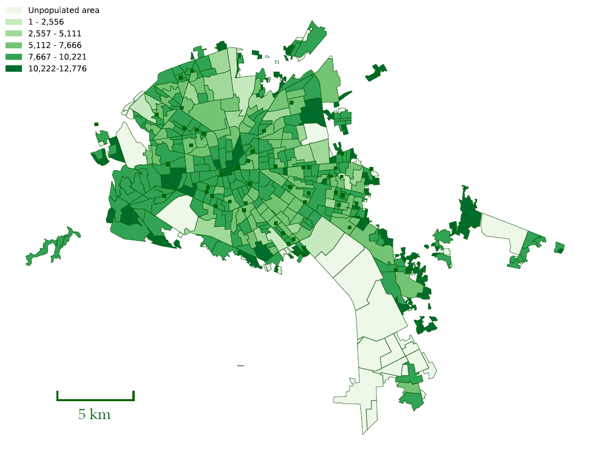
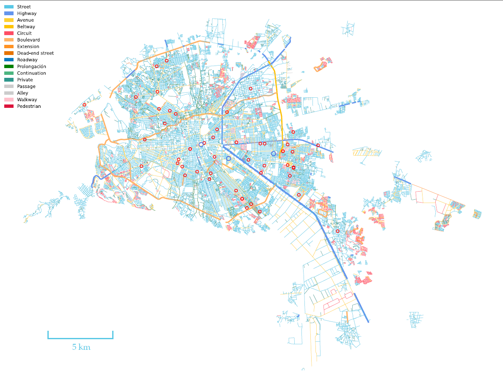
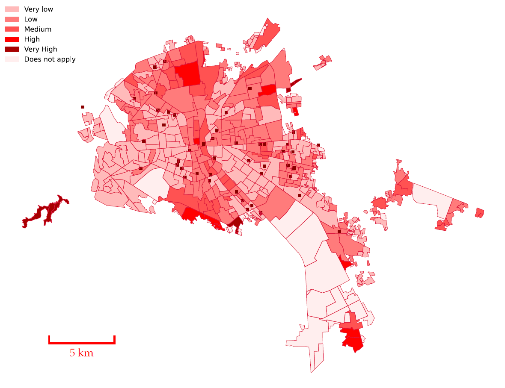
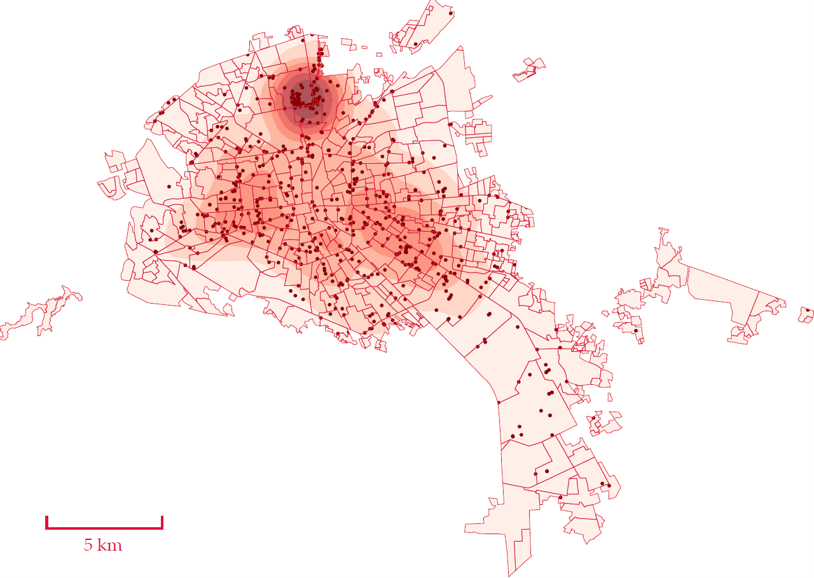

## Submission Guidelines for the EAAMO Social Hackathon
We invite you to submit your innovative solutions to the EAAMO Social Hackathon. Please follow the guidelines below to ensure your submission is complete and meets the expectations of the hackathon.

1. Project Description:
- System Overview: Provide a comprehensive description of your system, including its main features, functionalities, and user interface.
- Usage Instructions: Include detailed instructions for using the system, such as installation steps, user guides, and any necessary configurations.

2. Problem Statement:
- Identification of the Problem: Clearly define the specific problem your system seeks to address, highlighting its relevance to the challenge of breast cancer and environmental contaminants in Mexico.
- Importance of the Problem: Explain the significance of the problem, including its impact on public health, social disparities, and the urgency for a solution.

3. System Details:
- Technical Specifications: Provide technical details about the system architecture, programming languages, frameworks, and tools used in development.
- Prototype/Deployment: Indicate whether your solution is a prototype or a fully deployed system, and describe any deployment processes or requirements.

4. Evaluation and Impact:
- Known Limitations: Discuss any known limitations or challenges associated with your system, including potential technical, logistical, or scalability issues.
- Societal and Ethical Considerations: Address the societal and ethical considerations for using your system, particularly in the context of public health and data privacy.
- Impact Assessment: Provide an assessment of the potential impact of your solution on the identified problem, including quantitative and qualitative metrics if available.

5. Future Developments:
- Potential for Improvement: Outline potential future developments for your system, including additional features, enhancements, or scalability plans.
- Collaboration and Implementation: Describe how you envision collaborating with policymakers and other stakeholders to refine and implement your solution, ensuring its practical application and sustainability.

6. Submission Format:
- Main Document: Submit a PDF document that includes all the sections outlined above.
- Demo/Prototype: If applicable, provide a link to a live demo or a downloadable prototype of your system.
- Supplementary Materials: Include any additional materials that support your submission, such as video demonstrations, datasets, or user testimonials.

7. Submission Process:
- Submission Portal: Submit your documents and materials through the EAAMO Social Hackathon submission portal *[submission link will be available soon]*.
- Deadline: Ensure your submission is completed by the end of September *[exact date will be available soon]*.

We look forward to receiving your submissions and seeing how your innovative solutions can drive equity and access in addressing breast cancer and environmental contaminants in Mexico. For any questions or further information, please contact us.

## Challenges
Participants will form interdisciplinary teams to tackle critical challenges:
- **Early Detection**: Develop tools and technologies to improve early diagnosis.
- **Access to Care**: Enhance access to screening and treatment in rural and underserved areas.
- **Patient Support**: Create platforms or apps to provide support and resources to patients and their families.
- **Data Analysis**: Utilize data analytics to identify trends and improve treatment outcomes.

## Who Should Participate?
We welcome participants from all backgrounds, including:
- Medical professionals and researchers
- Data scientists and machine learning experts
- Software developers and engineers
- UX/UI designers
- Healthcare advocates and policy makers
- Students and educators

## Why Participate?
- **Collaborate**: Work with passionate individuals from diverse fields.
- **Innovate**: Develop cutting-edge solutions for real-world problems.
- **Network**: Connect with experts, mentors, and industry leaders.
- **Win Prizes**: Gain recognition and support for your innovative ideas.
- **Make an Impact**: Improve the lives of thousands of women across Mexico.

## How to Register
1. Visit our [registration page](https://docs.google.com/forms/d/e/1FAIpQLSdBheuBHIZdHUgx_Fk_lPvx5QhA4wWFqTFmbLzc6xETdB_s4w/viewform).
2. Fill out the registration form with your details.
3. Form or join a team, or register as an individual and we'll help you find a team.
4. Submit your registration by *(date to be announced)*.

Information about the data and the challenge will be available at the following [GitHub link](https://github.com/Mobile-Health-Center/Social-Hackathon-EAAMO-2024).

## Jury
- Dra. Yelda A. Leal. Directora Centro Institucional de Capacitación y Registro de Cáncer (CICYRC) Centro Médico Nacional S. XXI
- Dr. José Luis Morán López. Coordinador académico del Cenytro Nacional de Supercómputo y del Grupo de Ciencia e Ingeniería Computacionales del IPICYT.

## Visualizations
Just to give you a glimpse of the what is available within the data, please observe the following visualizations and their interpretations.

The map of San Luis Potosi in Mexico displays the population distribution across various regions within the city. The regions are color-coded to represent different population densities:
- Light Green (1 - 2,556): Areas with the lowest population density.
- Moderate Green (2,557 - 5,111): Regions with moderate population density.
- Medium Green (5,112 - 7,666): Areas with higher population density.
- Dark Green (7,667 - 10,221): Regions with very high population density.
- Deep Green (10,222 - 12,776): Areas with the highest population density.
- White: Unpopulated areas.

As one can observe, the central parts of San Luis Potosi have higher population densities, as seen by the darker shades of green, suggesting more urbanization and residential concentration. Peripheral areas exhibit a mix of moderate to low population densities, with some unpopulated regions.

In addition to the population map, one can also create a layout of streets and the distribution of schools across the city. The roads are color-coded to differentiate between various types, and schools are marked with red circles. 

The central part of San Luis Potosi has a dense network of streets, avenues, and other road types, indicating a well-developed urban infrastructure. Not surprisingly, the outskirts have fewer roads, with more beltways and extensions, suggesting less urbanization. Access to education is more-or-less well distributed with schools dispersed throughout the city. A higher concentration is in central areas, ensuring accessibility for most residents.

Another interesting data source is marginalization index. The marginalization index is a composite measure that evaluates the degree of exclusion or deprivation experienced by individuals or groups within a specific area, considering factors such as economic, social, and living conditions. It helps identify regions with higher levels of marginalization, guiding policy interventions and resource allocation to improve living standards and reduce inequality.

Areas are color-coded to represent varying levels of marginalization: very low (light pink), low (light red), medium (red), high (dark red), and very high (deep red). The central and some peripheral regions exhibit higher levels of marginalization, indicating significant exclusion and deprivation, whereas other parts of the city show lower levels of marginalization. This visualization might help in solving some of the tasks of this hackathon by identifying the most marginalized areas that require targeted interventions to improve living conditions and social inclusion.

Finally, one can see the polution index and polution sources. In other words, one can observe the level of pollutants in the environment, indicating areas with poor air quality or high contamination. Pollution sources, such as factories, traffic, and waste sites, contribute to higher pollution levels, affecting public health and the environment.

The map of San Luis Potosi, Mexico, shows the distribution of pollution levels and sources within the city. Areas with darker red shades indicate higher pollution levels, particularly concentrated in the northern and central parts of the city. Black dots represent stationary pollution sources, such as industrial sites, which are densely clustered in these high-pollution areas, highlighting the significant impact of industrial activity on air quality in these regions.